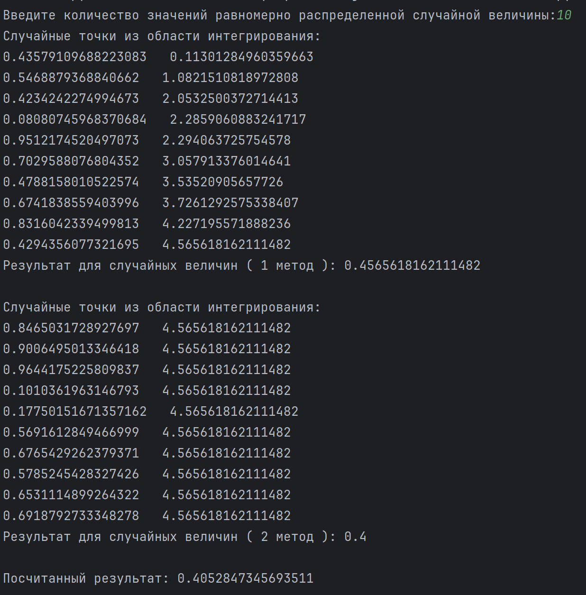
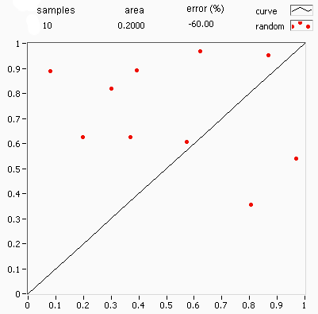

# В данном проекте представлены реализации некторых численных методов, в том числе интерполяционные, аппроксимационные и интегральные.
## monte-carlo.py: в программе присутствуют 2 метода вычисления двойного интеграла $$\int_0^1\int_0^1sin(pi*x)*cos((pi*y)/2)\mathrm{d}x\mathrm{d}y $$ с помощью генератора случайных величин.    
## Работа программы: 

